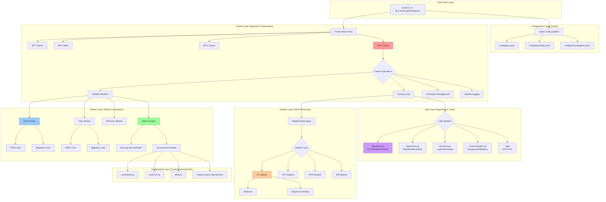
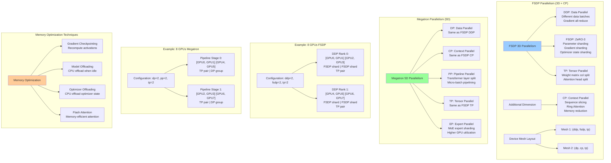

# RL2 System Architecture

This document provides comprehensive architecture diagrams for the RL2 (Ray Less Reinforcement Learning) framework.

---

## Table of Contents

1. [Overall System Architecture](#1-overall-system-architecture)
2. [PPO Training Pipeline](#2-ppo-training-pipeline)
3. [Worker Architecture](#3-worker-architecture)
4. [Data Flow](#4-data-flow)
5. [Parallelism Strategy](#5-parallelism-strategy)
6. [Rollout Engine Architecture](#6-rollout-engine-architecture)
7. [Sequence Packing Flow](#7-sequence-packing-flow)

---

## 1. Overall System Architecture



---

## 2. PPO Training Pipeline

```mermaid
sequenceDiagram
    participant User
    participant Trainer as PPO Trainer
    participant Actor as Actor Worker
    participant Critic as Critic Worker
    participant RefActor as Ref Actor
    participant Rollout as Rollout Engine
    participant Env as Environment
    participant SGLang as SGLang Server

    User->>Trainer: torchrun -m RL2.trainer.ppo
    Trainer->>Trainer: Initialize global process group
    Trainer->>Actor: initialize_actor(config, train=True)
    Trainer->>Critic: initialize_critic(config)
    Trainer->>RefActor: initialize_actor(config, train=False)
    Trainer->>Rollout: initialize_rollout(config)
    Rollout->>SGLang: Launch SGLang server/router

    loop For each epoch
        loop For each batch
            Note over Trainer,Env: [PHASE 1] Rollout (Rank 0 only)
            Trainer->>Rollout: rollout(data_list, train=True, step)

            loop For each data (async concurrent)
                loop For each turn (max_turns)
                    Rollout->>SGLang: async_generate(state)
                    SGLang-->>Rollout: action (LLM output)
                    Rollout->>Env: await env.step(state, action, extra_info)
                    Env-->>Rollout: {next_state, reward, score, done}
                    Rollout->>Rollout: Accumulate trajectory

                    alt Episode done or max turns
                        Rollout->>Rollout: Break loop
                    end
                end
            end

            Rollout->>Rollout: Pack tensor_dicts → tensor_dict
            Rollout->>Rollout: Compute cu_seqs
            Rollout-->>Trainer: tensor_dict, cu_seqs

            Note over Trainer,RefActor: [PHASE 2] Compute Values (Rank 0)

            alt KL regularization enabled
                Trainer->>RefActor: compute_logps(tensor_dict)
                RefActor->>RefActor: Forward pass (no grad)
                RefActor-->>Trainer: tensor_dict with ref_logps
            end

            alt GAE advantage estimation
                Trainer->>Critic: compute_values(tensor_dict)
                Critic->>Critic: Forward pass (no grad)
                Critic-->>Trainer: tensor_dict with values
            end

            alt Multiple updates per rollout
                Trainer->>Actor: compute_logps(tensor_dict)
                Actor->>Actor: Forward pass (no grad)
                Actor-->>Trainer: tensor_dict with old_logps
            end

            Trainer->>Trainer: compute_advantages(tensor_dict, cu_seqs)

            Note over Trainer,Critic: [PHASE 3] Update Models (All ranks)

            Trainer->>Actor: Broadcast tensor_dict to all ranks
            Trainer->>Actor: ppo_update(tensor_dict, step)

            loop For each batch (multiple updates)
                loop For each minibatch
                    Actor->>Actor: scatter_data() → minibatches
                    Actor->>Actor: Forward pass → new_logps, entropy
                    Actor->>Actor: Compute PPO clipped loss
                    Actor->>Actor: Backward + clip_grad_norm
                end
                Actor->>Actor: optimizer.step()
                Actor->>Actor: scheduler.step()
            end

            alt GAE enabled
                Trainer->>Critic: ppo_update(tensor_dict, step)
                loop For each batch
                    loop For each minibatch
                        Critic->>Critic: Forward pass → new_values
                        Critic->>Critic: Compute value loss
                        Critic->>Critic: Backward
                    end
                    Critic->>Critic: optimizer.step()
                end
            end

            Note over Trainer,SGLang: [PHASE 4] Sync Weights

            Trainer->>Actor: update_rollout(rollout, step)
            Actor->>Actor: Export model weights
            Actor->>Rollout: Send weights via update()
            Rollout->>SGLang: Update SGLang server weights

            Trainer->>Trainer: save_ckpt(step)

            alt Test frequency reached
                Trainer->>Rollout: rollout(test_data, train=False, step)
            end
        end
    end

    Trainer->>Actor: save_model()
    Trainer->>Critic: save_model()
```

---

## 3. Worker Architecture

```mermaid
graph TB
    subgraph "Worker Hierarchy"
        WorkerBase[Worker Base Class]
        WorkerBase --> FSDPWorker[FSDP Worker]
        WorkerBase --> MegatronWorker[Megatron Worker]

        FSDPWorker --> FSDPActor[FSDP Actor]
        FSDPWorker --> FSDPCritic[FSDP Critic]

        MegatronWorker --> MegatronActor[Megatron Actor]
        MegatronWorker --> MegatronCritic[Megatron Critic]
    end

    subgraph "FSDP Actor Components"
        FSDPActor --> FSDPModel[CausalLM Model]
        FSDPActor --> FSDPOpt[AdamW Optimizer]
        FSDPActor --> FSDPSched[Cosine Scheduler]
        FSDPActor --> FSDPMesh[Device Mesh]

        FSDPMesh --> FSDPMesh1["(ddp, fsdp, tp) mesh"]
        FSDPMesh --> FSDPMesh2["(dp, cp, tp) mesh"]

        FSDPModel --> FlashAttn2[Flash Attention 2]
        FSDPModel --> RingAttn[Ring Attention for CP]
        FSDPModel --> LigerKernel[Liger Kernel (optional)]
    end

    subgraph "FSDP Actor Methods"
        FSDPActor --> FSDPForward[forward]
        FSDPActor --> FSDPCompute[compute_logps]
        FSDPActor --> FSDPUpdate{Update Methods}
        FSDPUpdate --> FSDPSFT[sft_update]
        FSDPUpdate --> FSDPDPO[dpo_update]
        FSDPUpdate --> FSDPPPO[ppo_update]
        FSDPActor --> FSDPUpdateRollout[update_rollout]
    end

    subgraph "Megatron Actor Components"
        MegatronActor --> MegatronBridge[mbridge Model Bridge]
        MegatronActor --> MegatronModel[Megatron GPT Model]
        MegatronActor --> MegatronOpt[Distributed Optimizer]

        MegatronModel --> PackedSeq[Packed Sequence Params]
        MegatronModel --> Pipeline[Pipeline Parallel]
        MegatronModel --> Expert[Expert Parallel (MoE)]
    end

    subgraph "Megatron Actor Methods"
        MegatronActor --> MegForward[forward_backward]
        MegatronActor --> MegCompute[compute_logps]
        MegatronActor --> MegUpdate{Update Methods}
        MegUpdate --> MegSFT[sft_update]
        MegUpdate --> MegDPO[dpo_update]
        MegUpdate --> MegPPO[ppo_update]
        MegatronActor --> MegUpdateRollout[update_rollout]
    end

    subgraph "Critic Architecture"
        FSDPCritic --> CriticModel[CausalLM + Value Head]
        MegatronCritic --> MegCriticModel[Megatron + Value Head]

        CriticModel --> ComputeValues[compute_values]
        CriticModel --> PPOUpdateCritic[ppo_update]
    end

    style FSDPActor fill:#99ccff
    style MegatronActor fill:#99ccff
    style FSDPCritic fill:#ffcc99
    style MegatronCritic fill:#ffcc99
```

---

## 4. Data Flow

```mermaid
graph LR
    subgraph "Data Loading"
        RawData[Raw Dataset<br/>JSON/JSONL/CSV/HF] --> DatasetClass[Dataset Class<br/>SFT/RM/DPO/RL]
        DatasetClass --> Tokenize[Tokenization]
        Tokenize --> TensorDict1[Tensor Dict<br/>states/actions/masks]
    end

    subgraph "Rollout Phase (Rank 0)"
        TensorDict1 --> Rollout[Rollout Engine]
        Rollout --> AsyncGen[Async Generate<br/>via SGLang]
        AsyncGen --> EnvStep[Environment Step]
        EnvStep --> Trajectory[Trajectory<br/>Collection]
        Trajectory --> TensorDict2[Tensor Dict<br/>+ rewards/logps]
        TensorDict2 --> PackTensors[pack_tensor_dicts]
        PackTensors --> CuSeqs[Compute cu_seqs]
    end

    subgraph "Compute Phase (Rank 0)"
        CuSeqs --> RefActor[Ref Actor<br/>compute_logps]
        RefActor --> TensorDict3[+ ref_logps]
        TensorDict3 --> Critic[Critic<br/>compute_values]
        Critic --> TensorDict4[+ values]
        TensorDict4 --> Actor[Actor<br/>compute_logps]
        Actor --> TensorDict5[+ old_logps]
        TensorDict5 --> ComputeAdv[Compute<br/>Advantages]
        ComputeAdv --> TensorDict6[+ advantages]
    end

    subgraph "Scatter Phase"
        TensorDict6 --> Broadcast[Broadcast<br/>to all ranks]
        Broadcast --> Scatter[scatter_data]
        Scatter --> Balance[Balanced<br/>Partitioning]
        Balance --> Minibatches[Minibatches<br/>per DP rank]
    end

    subgraph "Update Phase (All Ranks)"
        Minibatches --> ActorForward[Actor Forward]
        ActorForward --> ComputeLoss[Compute Loss<br/>PPO/DPO/SFT]
        ComputeLoss --> Backward[Backward Pass]
        Backward --> GradClip[Gradient Clipping]
        GradClip --> AllReduce[All-Reduce<br/>Gradients]
        AllReduce --> OptStep[Optimizer Step]
    end

    subgraph "Gather Phase"
        OptStep --> GatherMetrics[Gather Metrics]
        GatherMetrics --> LogWandb[Log to Wandb]
        OptStep --> SaveCkpt[Save Checkpoint]
    end

    subgraph "Weight Sync Phase"
        OptStep --> ExportWeights[Export Weights]
        ExportWeights --> SerializeTensor[Serialize Tensors]
        SerializeTensor --> UpdateSGLang[Update SGLang<br/>Server]
    end

    style Rollout fill:#99ff99
    style ComputeAdv fill:#cc99ff
    style ActorForward fill:#99ccff
    style UpdateSGLang fill:#ff9999
```



---

## 5. Parallelism Strategy



---

## 6. Rollout Engine Architecture

```mermaid
graph TB
    subgraph "Rollout Engine Initialization"
        RolloutInit[Rollout.__init__]
        RolloutInit --> PrepMesh[Prepare Device Mesh<br/>dp × tp]
        PrepMesh --> PrepEnv[Prepare Environment<br/>Import env module]
        PrepMesh --> LaunchServers{Launch SGLang}

        LaunchServers --> ServerPerTP["Each TP rank 0:<br/>Launch SGLang Server"]
        ServerPerTP --> GatherURLs[Gather worker_urls<br/>via DP group]

        LaunchServers --> RouterRank0["Rank 0 only:<br/>Launch SGLang Router"]
        RouterRank0 --> LoadBalance[Load Balancer<br/>across workers]
    end

    subgraph "Rollout Execution Flow"
        RolloutCall[Rollout.__call__]
        RolloutCall --> RolloutLoop["For each data<br/>(async concurrent)"]

        RolloutLoop --> InitState[Initialize state_dict<br/>states/actions/masks/rewards]
        InitState --> TurnLoop[For each turn]

        TurnLoop --> AsyncGen[async_generate<br/>via Router]
        AsyncGen --> RouterForward[Router distributes<br/>to least busy worker]
        RouterForward --> WorkerGen[SGLang Worker<br/>generates action]
        WorkerGen --> ReturnAction[Return action +<br/>logprobs + meta_info]

        ReturnAction --> EnvStep[await env.step<br/>state, action, extra_info]
        EnvStep --> EnvResponse[Environment returns<br/>next_state, reward, done]

        EnvResponse --> UpdateState[Update state_dict<br/>Append tokens/rewards]
        UpdateState --> CheckDone{Done or<br/>max turns?}

        CheckDone -->|Yes| SaveTraj[Save trajectory<br/>as tensor_dict]
        CheckDone -->|No| CheckCont{next_state<br/>continuous?}

        CheckCont -->|Yes| AppendDelta[Append delta<br/>to state_dict]
        CheckCont -->|No| NewSeq[Save current<br/>Start new sequence]

        AppendDelta --> TurnLoop
        NewSeq --> TurnLoop

        SaveTraj --> CollectMetrics[Collect metrics<br/>length/turns/scores]
    end

    subgraph "Post-Rollout Processing"
        CollectMetrics --> PackAll[Pack all tensor_dicts]
        PackAll --> DynamicFilter{Dynamic<br/>filtering?}

        DynamicFilter -->|Yes| FilterRewards[Filter groups with<br/>std(rewards) == 0]
        DynamicFilter -->|No| ComputeCuSeqs[Compute cu_seqs<br/>cumulative sequences]

        FilterRewards --> ComputeCuSeqs
        ComputeCuSeqs --> ReleaseMemory[Release SGLang<br/>memory occupation]
        ReleaseMemory --> ReturnData[Return<br/>tensor_dict, cu_seqs]
    end

    subgraph "Weight Update Flow"
        UpdateCall[Rollout.update]
        UpdateCall --> FlushCache[Flush SGLang cache]
        FlushCache --> ResumeMemory[Resume memory<br/>occupation]
        ResumeMemory --> IterWeights[Iterate named_tensors<br/>from Actor]
        IterWeights --> Serialize[Serialize tensors<br/>DTensor → full_tensor]
        Serialize --> GatherTP[Gather across<br/>TP group]
        GatherTP --> SendWorker[Send to SGLang<br/>worker via HTTP]
        SendWorker --> FlushCache2[Flush cache again]
    end

    style RolloutInit fill:#99ff99
    style RolloutCall fill:#99ccff
    style UpdateCall fill:#ff9999
```

---

## 7. Sequence Packing Flow

```mermaid
graph TB
    subgraph "Input: Tensor Dict from Rank 0"
        InputDict["tensor_dict:<br/>states: [N, L]<br/>actions: [N, L]<br/>action_mask: [N, L]<br/>eos_mask: [N, L]<br/>rewards: [N, L]<br/>etc."]
    end

    subgraph "Step 1: Sequence Length Extraction"
        InputDict --> ExtractLen[Extract sequence lengths<br/>seq_lens = eos_mask.argmax + 1]
        ExtractLen --> CheckPair{Pair mode?}
        CheckPair -->|Yes| SumPairs[Sum adjacent pairs<br/>for DPO/RM]
        CheckPair -->|No| SeqLenList[seq_len_list]
        SumPairs --> SeqLenList
    end

    subgraph "Step 2: Calculate Minibatch Count"
        SeqLenList --> TotalLen[total_len = sum(seq_len_list)]
        TotalLen --> MinCount[n_minibatches = ceil<br/>total_len / max_length_per_dp]
        MinCount --> AlignDP[Align to multiple of<br/>dp_size]
        AlignDP --> InitN[Initial n_minibatches]
    end

    subgraph "Step 3: Balanced Partitioning Loop"
        InitN --> LoopStart{Loop}

        LoopStart --> CheckCount[n_minibatches > len(seq_len_list)?]
        CheckCount -->|Yes| PadSeqs[Pad sequences<br/>with zeros]
        CheckCount -->|No| SkipPad[No padding needed]

        PadSeqs --> CallBalance[get_seqlen_balanced_partitions<br/>seq_len_list, k=n_minibatches]
        SkipPad --> CallBalance

        CallBalance --> BalanceAlgo["Balanced Packing Algorithm:<br/>1. Sort sequences descending<br/>2. For each sequence:<br/>   Place in partition with<br/>   min current length<br/>3. Result: k balanced partitions"]

        BalanceAlgo --> CheckMax[max_partition_length ≤<br/>max_length_per_dp?]

        CheckMax -->|No| IncreaseN[n_minibatches += dp_size]
        CheckMax -->|Yes| LoopDone[Partitioning successful]

        IncreaseN --> LoopStart
    end

    subgraph "Step 4: Construct Minibatches"
        LoopDone --> ExpandPairs{Pair mode?}
        ExpandPairs -->|Yes| UnfoldPairs[Unfold pairs<br/>[idx] → [2*idx, 2*idx+1]]
        ExpandPairs -->|No| KeepPartitions[Keep partitions]

        UnfoldPairs --> ShuffleIndices[Store shuffle_indices<br/>for later reversing]
        KeepPartitions --> ShuffleIndices

        ShuffleIndices --> CreateMinibatches["Create minibatches:<br/>For each partition:<br/>  minibatch = {<br/>    k: tensor_dict[k][partition]<br/>    for all keys<br/>  }"]
    end

    subgraph "Step 5: Scatter to DP Ranks"
        CreateMinibatches --> BroadcastMinibatches[Broadcast minibatches<br/>from Rank 0 to all ranks]
        BroadcastMinibatches --> ChunkDP[Chunk by dp_size<br/>Each DP rank gets<br/>len(minibatches) / dp_size]
        ChunkDP --> MoveCUDA[Move minibatches<br/>to CUDA device]
    end

    subgraph "Step 6: Gather from DP Ranks (After Processing)"
        MoveCUDA --> ProcessMinibatches[Process minibatches<br/>forward/backward]
        ProcessMinibatches --> MoveCPU[Move results to CPU]
        MoveCPU --> GatherAll[Gather all minibatches<br/>to Rank 0]
        GatherAll --> PadLength[Pad to max length<br/>across minibatches]
        PadLength --> ConcatMinibatches[Concatenate minibatches]
        ConcatMinibatches --> ReverseIndices[Reverse shuffle using<br/>shuffle_indices]
        ReverseIndices --> RemovePad[Remove padded sequences<br/>if any]
        RemovePad --> FinalTensorDict[Final tensor_dict<br/>in original order]
    end

    style BalanceAlgo fill:#99ff99
    style CreateMinibatches fill:#99ccff
    style ProcessMinibatches fill:#ffcc99
```

---

## 8. Key Data Structures

### Tensor Dict Format

```
tensor_dict = {
    # Core fields (all algorithms)
    "states":       [batch, seq_len]  # Input token IDs
    "position_ids": [batch, seq_len]  # Position IDs
    "eos_mask":     [batch, seq_len]  # End-of-sequence mask

    # Training fields (SFT/DPO/PPO)
    "actions":      [batch, seq_len]  # Action token IDs
    "action_mask":  [batch, seq_len]  # Action mask (0/1)

    # PPO-specific fields
    "logps":        [batch, seq_len]  # log π(a|s) current
    "old_logps":    [batch, seq_len]  # log π_old(a|s) frozen
    "ref_logps":    [batch, seq_len]  # log π_ref(a|s) reference
    "llm_logps":    [batch, seq_len]  # log π_llm(a|s) from rollout
    "rewards":      [batch, seq_len]  # Rewards from environment
    "advantages":   [batch, seq_len]  # Computed advantages
    "entropy":      [batch, seq_len]  # Policy entropy

    # GAE-specific fields
    "values":       [batch, seq_len]  # V(s) current
    "old_values":   [batch, seq_len]  # V_old(s) frozen
    "returns":      [batch, seq_len]  # Returns (advantages + values)

    # RM-specific fields
    "rewards":      [batch, 1]        # Scalar reward per sequence
}
```

### Device Mesh Configurations

```python
# FSDP Actor/Critic
device_mesh = {
    "ddp":  DeviceMesh with shape (ddp_size,)
    "fsdp": DeviceMesh with shape (fsdp_size,)
    "tp":   DeviceMesh with shape (tp_size,)
    "dp":   DeviceMesh with shape (dp_size,)
    "cp":   DeviceMesh with shape (cp_size,)
}

# Rollout Engine
device_mesh = {
    "dp": DeviceMesh with shape (world_size // tp_size,)
    "tp": DeviceMesh with shape (tp_size,)
}
```

---

## 9. Configuration Hierarchy

```mermaid
graph LR
    subgraph "Hydra Configuration System"
        CLI[Command Line Args]
        CLI --> Override[Override Default Config]

        DefaultConfig[defaults:<br/>- actor: fsdp<br/>- ref_actor: $actor<br/>- critic: $actor]

        Override --> FinalConfig[Final Resolved Config]
        DefaultConfig --> FinalConfig

        FinalConfig --> TrainerConfig[trainer:<br/>n_epochs, save_freq<br/>project, experiment_name]
        FinalConfig --> ActorConfig[actor:<br/>model_name, ddp_size<br/>tp_size, cp_size<br/>max_length_per_device]
        FinalConfig --> CriticConfig[critic:<br/>inherits from actor<br/>+ critic-specific params]
        FinalConfig --> RolloutConfig[rollout:<br/>server_args, max_turns<br/>env_path, sampling_params]
        FinalConfig --> DataConfig[train_data/test_data:<br/>path, prompts_per_rollout<br/>responses_per_prompt]
        FinalConfig --> AdvConfig[adv:<br/>estimator (reinforce/gae)<br/>gamma, lamda]
    end

    subgraph "Backend Selection"
        ActorConfig --> BackendChoice{Backend Choice}
        BackendChoice --> FSDP[actor: fsdp<br/>→ FSDPActor]
        BackendChoice --> Megatron[actor: megatron<br/>→ MegatronActor]

        FSDP --> FSDPSubConfig[actor/fsdp.yaml<br/>ddp_size, tp_size<br/>enable_gradient_checkpointing]
        Megatron --> MegSubConfig[actor/megatron.yaml<br/>pp_size, ep_size<br/>packed_sequence]
    end

    style FinalConfig fill:#99ccff
    style BackendChoice fill:#99ff99
```

---

## 10. Checkpoint Structure

```
save_dir/step{N}/
├── actor/
│   ├── model/
│   │   ├── config.json              # HuggingFace model config
│   │   ├── pytorch_model.bin        # Model weights
│   │   ├── tokenizer_config.json
│   │   └── tokenizer.json
│   └── optimizer_scheduler/
│       ├── __0_0.distcp             # Distributed checkpoint shards
│       ├── __1_0.distcp
│       └── .metadata
├── critic/                          # (if GAE enabled)
│   ├── model/
│   └── optimizer_scheduler/
└── trainer/
    ├── __0_0.distcp                 # DataLoader state
    └── .metadata
```

---

## 11. Logging Metrics Hierarchy

```mermaid
graph TB
    subgraph "Wandb Logging Structure"
        WandbRoot[Wandb Project]
        WandbRoot --> RolloutMetrics[Rollout Metrics]
        WandbRoot --> ActorMetrics[Actor Metrics]
        WandbRoot --> CriticMetrics[Critic Metrics]
        WandbRoot --> AdvMetrics[Advantage Metrics]
        WandbRoot --> TimeMetrics[Time Metrics]
    end

    subgraph "Rollout Metrics"
        RolloutMetrics --> RespLen["response_length/train<br/>response_length/test"]
        RolloutMetrics --> ClipRatio["length_clip_ratio/train<br/>length_clip_ratio/test"]
        RolloutMetrics --> Turns["n_turns/train<br/>n_turns/test"]
        RolloutMetrics --> Scores["scores/train<br/>scores/test"]
    end

    subgraph "Actor Metrics"
        ActorMetrics --> ActorLoss["actor/loss<br/>PPO clipped objective"]
        ActorMetrics --> ActorEntropy["actor/entropy<br/>Policy entropy"]
        ActorMetrics --> ActorClip["actor/clip_ratio<br/>Proportion clipped"]
        ActorMetrics --> ActorGrad["actor/grad_norm<br/>Gradient norm"]
        ActorMetrics --> ActorKL["actor/kl<br/>KL divergence"]
    end

    subgraph "Critic Metrics"
        CriticMetrics --> CriticLoss["critic/loss<br/>Value function loss"]
        CriticMetrics --> CriticGrad["critic/grad_norm<br/>Gradient norm"]
        CriticMetrics --> CriticClip["critic/clip_ratio<br/>Proportion clipped"]
    end

    subgraph "Advantage Metrics"
        AdvMetrics --> AdvMean["adv/mean<br/>Mean advantage"]
        AdvMetrics --> AdvStd["adv/std<br/>Std advantage"]
        AdvMetrics --> RewardMean["reward/mean<br/>Mean reward"]
    end

    subgraph "Time Metrics"
        TimeMetrics --> RolloutTime["time/rollout<br/>Rollout duration"]
        TimeMetrics --> UpdateTime["time/update_actor<br/>Actor update duration"]
        TimeMetrics --> ComputeTime["time/compute_logps<br/>LogProb computation"]
    end

    style WandbRoot fill:#ff9999
    style RolloutMetrics fill:#99ff99
    style ActorMetrics fill:#99ccff
    style CriticMetrics fill:#ffcc99
```



---

## Summary

This architecture document provides a comprehensive view of the RL2 framework:

1. **Overall System Architecture** - 5-layer modular design
2. **PPO Training Pipeline** - Complete training loop with sequence diagram
3. **Worker Architecture** - FSDP vs Megatron implementations
4. **Data Flow** - End-to-end data transformation pipeline
5. **Parallelism Strategy** - 3D/5D distributed training strategies
6. **Rollout Engine** - Async environment interaction with SGLang
7. **Sequence Packing** - Efficient batching algorithm
8. **Key Data Structures** - Tensor dict and device mesh formats
9. **Configuration System** - Hydra-based config hierarchy
10. **Checkpoint Structure** - Distributed checkpoint layout
11. **Logging Metrics** - Wandb metrics hierarchy

The architecture emphasizes:
- **Modularity**: Clean separation between trainers, workers, datasets, and utils
- **Flexibility**: Pluggable backends (FSDP/Megatron) and algorithms (SFT/RM/DPO/PPO)
- **Scalability**: Support for 3D-5D parallelism strategies
- **Efficiency**: Sequence packing, async inference, flash attention
- **Simplicity**: Clear implementation without excessive abstractions
